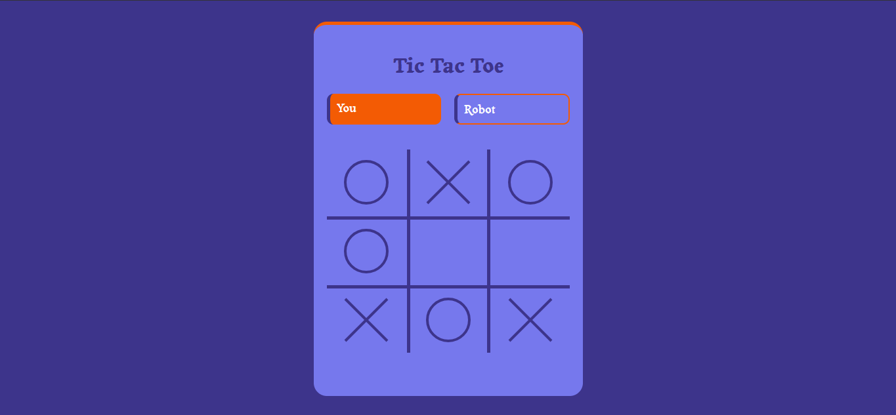

# Tic Tac Toe Game Using HTML, CSS, and JavaScript

This is a fully responsive **Tic Tac Toe** game built using **HTML**, **CSS**, and **JavaScript**. The game allows a single player to compete against a basic AI (robot opponent).

## 🔧 Features

- 🎮 Single-player mode vs. computer
- 📱 Fully responsive design (mobile, tablet, desktop)
- 💡 Simple and clean UI
- ⚙️ Logic built purely with JavaScript (no libraries)

## 🚀 How to Play

1. Clone or download the repository.
2. Open `index.html` in your browser.
3. Choose your move — the computer will automatically respond.
4. The game ends when there’s a winner or a draw.

## 📁 Technologies Used

- HTML5
- CSS3
- Vanilla JavaScript

## 📸 Demo

