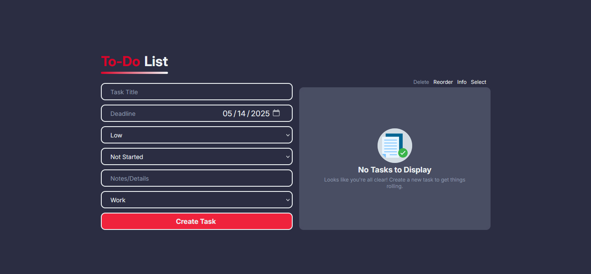
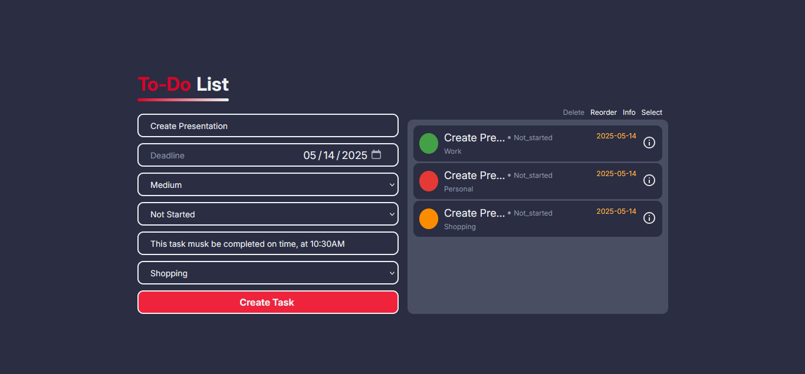
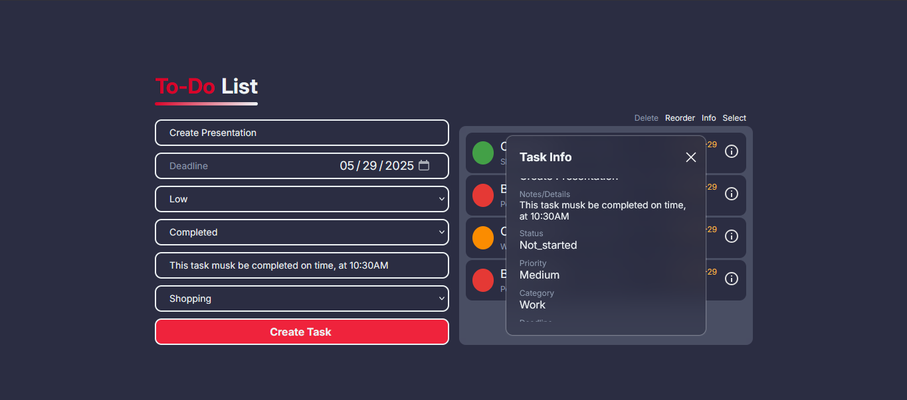

# 📝 Responsive To-Do List App

A modern, responsive To-Do List web app that allows users to:

- ✅ Create and manage tasks

- 🔃 Reorder tasks using drag-and-drop

- 💾 Save tasks in localStorage (persistent across sessions)

- ❌ Delete individual tasks

- 🔘 Select/mark tasks as completed

## 🚀 Features

- Responsive Design – Works seamlessly on desktops, tablets, and mobile devices.

- Task Creation – Add new tasks with a simple input field.

- Task Selection – Mark tasks as complete/incomplete.

- Drag & Drop Reordering – Easily rearrange tasks by dragging.

- Persistent Storage – Tasks are stored in localStorage and reloaded on refresh.

- Delete Tasks – Remove tasks from the list.

## 💻 Technologies Used

- HTML5

- CSS3 (Responsive design using Flexbox and media queries)

- JavaScript (Vanilla)

- LocalStorage API

- Drag-and-drop library (Sortable.js)

## 📄 License 
MIT License. Feel free to use, modify, and share!

## 🖼️ Preview

