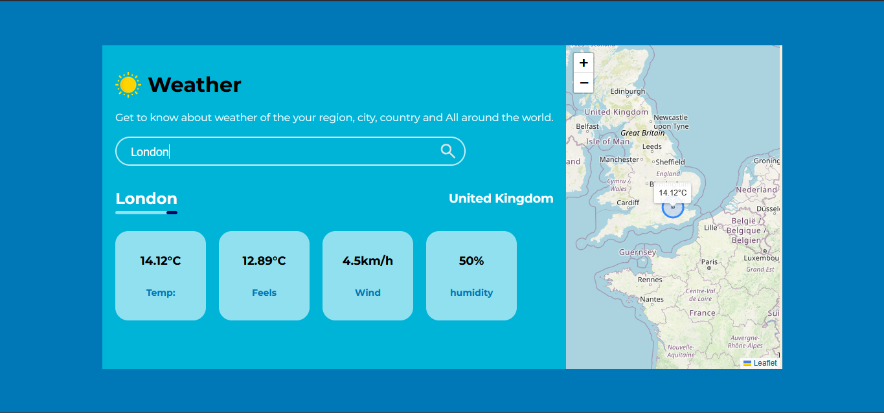

# Weather Web Page Using HTML, CSS, and JavaScript

This Weather Web Page is a simple and interactive application that allows users to search for any city and instantly view the current weather conditions. The page displays essential weather details including temperature, feels-like temperature, wind speed, and humidity, all fetched in real-time using the OpenWeatherMap API.

## Tech Stack:
- HTML
- CSS
- JavaScript
- OpenWeatherMap
- LeafletJs

## License:
This project is licensed under the MIT License.

## Screenshot:

