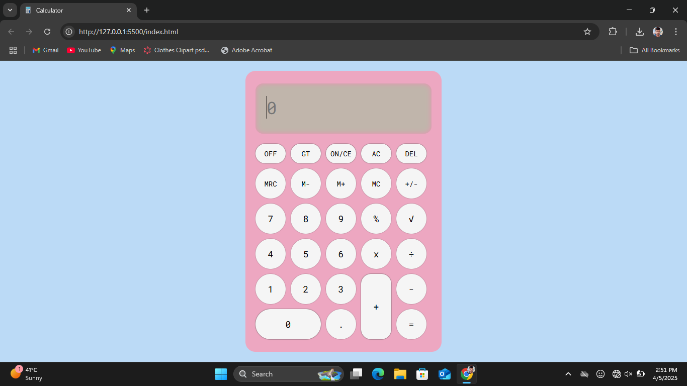
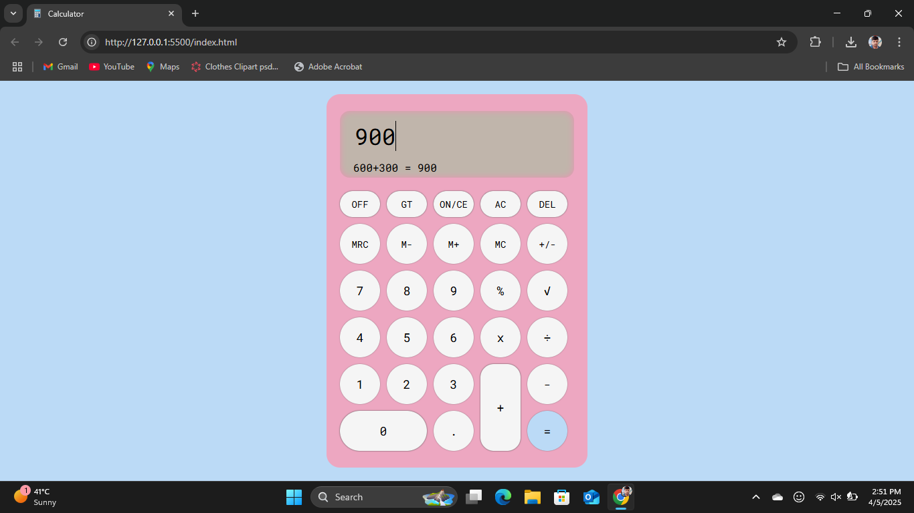

#  Calculator Using HTML, CSS, JavaScript

## 📝 Introduction

Welcome to the **Calculator with Memory Recall (MRC)**! This is a simple yet powerful calculator built using **HTML**, **CSS**, and **JavaScript**. It features all the basic arithmetic operations such as addition, subtraction, multiplication, and division. In addition, it includes memory functions like **Memory Recall (MRC)**, **Memory Clear (MC)**, and **Memory Add (M+)**, making it more interactive and useful.

## 🧑‍💻 Features

- Basic arithmetic operations (addition, subtraction, multiplication, division)
- Module and UnderRoot operations
- Memory Recall
- Grand Total
- Clean and responsive design
- Easy-to-use interface

## 🚀 Getting Started

### Project Structure
Here’s the basic layout of the project:
```perl
    my-project/
        ├── css 
        ├── js
        ├── index.html
        └── README.md  
```

### What You Need
Before jumping in, make sure you have:
- A web browser (Chrome, Firefox, Edge, etc.)
- A text editor (VS Code, Sublime Text, etc.)

You don't need any fancy setup to get this working, but if you'd like to test locally with a live server, I’ll show you how!

## 🖥️ Running Locally
### 1. Clone or Download the Files
Start by getting the project files onto your computer. You can either clone the repo or download it as a ZIP.
- Clone the project using Git:
```bash
    -> git clone <your-repository-url>
```
- Or download the ZIP file and unzip it.

### 2. Open the Project in a Code Editor
After downloading or cloning the project, open the project folder in your favorite code editor (e.g., Visual Studio Code, Sublime Text, etc.).

### 3. View the Calculator in Your Browser
Once you have the files in your code editor:
- Open the `index.html` file.
- Right-click and choose Open with Live Server (if you have the Live Server extension in VS Code) or simply open the file in any modern web browser (e.g., Chrome, Firefox).

The calculator will now be accessible in your browser.

## 📝 License
This project is open-source and available under the MIT License.

## 🖼️ Screenshots


