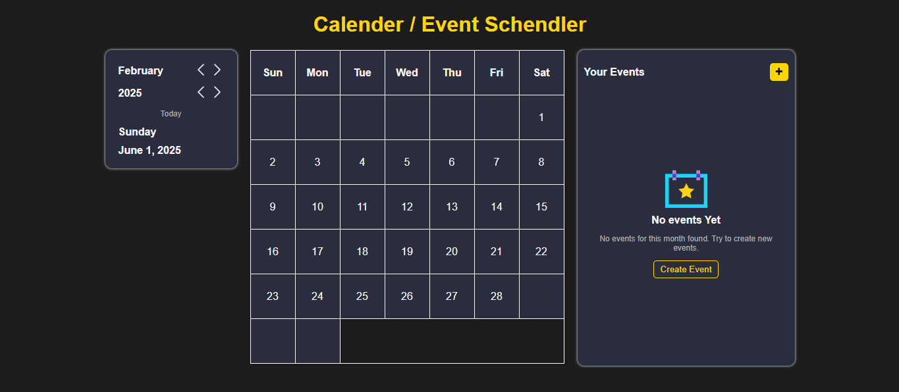
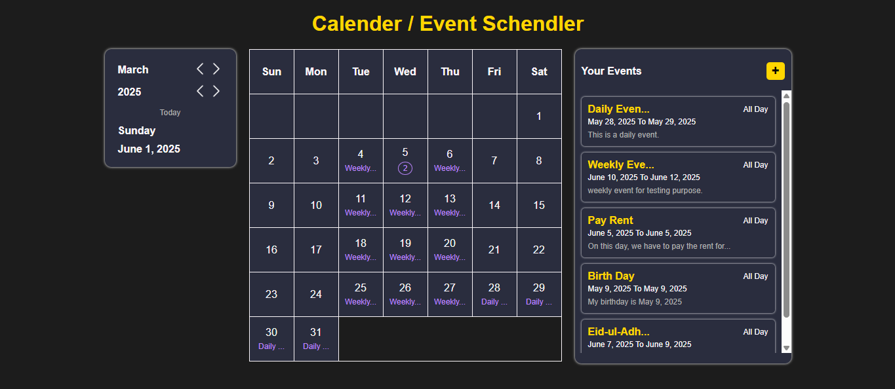
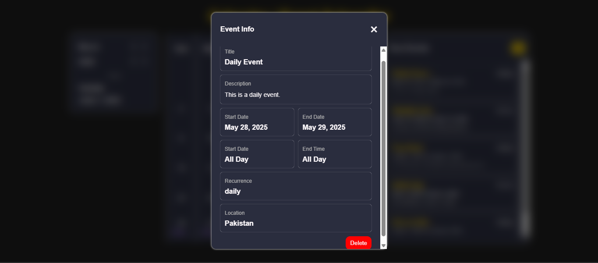
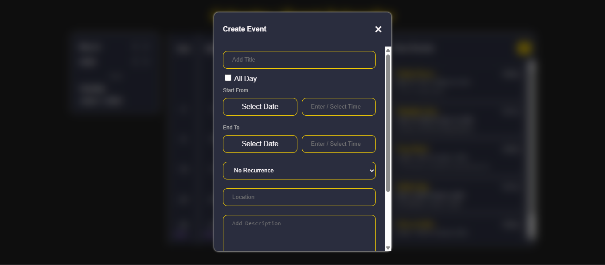

# Calendar App

A simple, modern calendar web application for managing events with support for recurring events, event details, and a clean UI.

## Features

- **Add, view, and delete events**
- **Recurring events** (daily, weekly, monthly, yearly)
- **All-day and timed events**
- **Responsive and modern design**
- **Event details modal**
- **Event list and calendar view**
- **Persistent storage using LocalStorage**

## File Structure

```
/js
  ├── main.js           # App entry, event listeners, UI glue
  ├── calender.js       # Calendar rendering and navigation
  ├── eventManager.js   # Event CRUD and storage logic
  ├── DOM.js            # DOM element queries and UI helpers
  ├── utils.js          # Utility functions (date formatting, etc.)
/styles.css             # Main stylesheet
/index.html             # Main HTML file
/README.md              # Project documentation
```

## Getting Started

1. **Clone or download the repository.**
2. Open `index.html` in your browser.
3. Start adding and managing your events!

## Usage

- Click **"Add Event"** to create a new event.
- Select a date, time, and recurrence (if needed).
- View event details by clicking on an event in the list or calendar.
- Delete events from the event details modal.

## Customization

- Edit `styles.css` to change the look and feel.
- Modify or extend JS modules for new features (e.g., notifications, color coding).

## Contributing

Pull requests and suggestions are welcome! Please open an issue to discuss changes.

## License

MIT License

---

**Made with ❤️ for learning and productivity.**

## Screenshots

;
;
;
;
