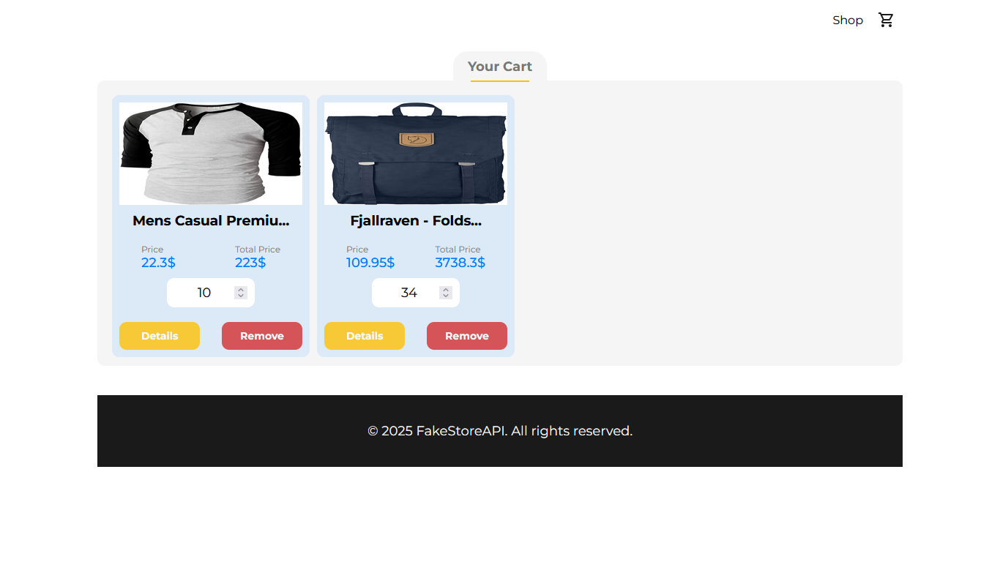
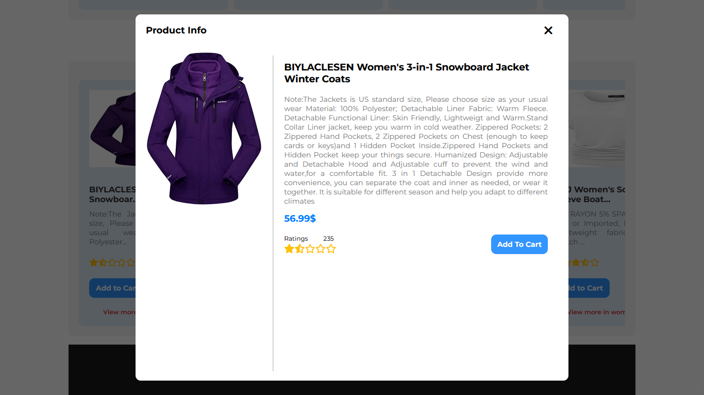

# 🛍️ Dynamic Product Page Using HTML, CSS, JavaScript

A clean and responsive product page built with **HTML**, **CSS**, and **Vanilla JavaScript**. It includes core e-commerce features such as a **shopping cart**, **add-to-cart functionality**, and a **modal dialog box** for product previews or confirmations.

## 🔧 Features

- ✅ Product display with image, title, price, and description
- 🛒 Interactive shopping cart with item count and total price
- ➕ "Add to Cart" button with visual feedback
- 💬 Modal dialog box for product preview or action confirmation
- 📱 Responsive layout for mobile and desktop views
- 💡 Built without any external libraries or frameworks

## 💡 Tech Stack

- HTML5 for structure
- CSS3 for styling and responsiveness
- Vanilla JavaScript for interactivity and logic

## 📄 License
This project is open source and free to use under the MIT License.

## 📸 Screenshots

